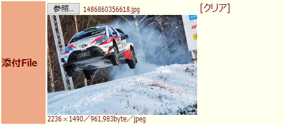
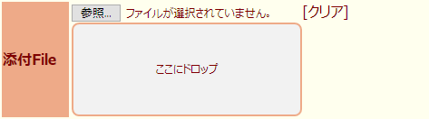

## futaba form image previewer
このUserscriptはふたば☆ちゃんねるの返信フォームの添付ファイル欄に添付ファイルのプレビューとクリアボタンを追加するものです。添付ファイルの確認や間違って添付したファイルをクリアするのに役に立ちます。  

Firefoxは[Tampermonkey](https://addons.mozilla.org/ja/firefox/addon/tampermonkey/)を先にインスールしてからスクリプトをインストールして下さい。  
（GreasemonkeyやViolentmonkeyでの動作は未確認です）  
Chromeは[Tampermonkey](https://chrome.google.com/webstore/detail/tampermonkey/dhdgffkkebhmkfjojejmpbldmpobfkfo)を先にインスールしてからスクリプトをインストールして下さい。  

※**このUserscriptはv0.4.4をもちまして開発を終了しました。**

※FirefoxでKOSHIAN（改）アドオンを使用している環境では、このスクリプトの代わりにほぼ同機能でクリップボード内の画像ファイルの添付機能が追加された[**KOSHIAN 返信フォーム拡張 改**](https://github.com/akoya-tomo/koshian_form_futaba_kai/)アドオンの使用を推奨します。  

※他のふたば閲覧支援ツールは[こちら](https://github.com/akoya-tomo/futaba_auto_reloader_K/wiki)。  

## 使い方
* ふたばのレス画面の返信フォームの添付ファイルを選択すると自動でプレビューが表示されます。  
（最大表示サイズ：250px×250px）  
   
* ［クリア」ボタンを押すと添付ファイルが消去され、プレビューも消えます。  
* [KOSHIAN 返信フォーム拡張](https://addons.mozilla.org/ja/firefox/addon/koshian-%E8%BF%94%E4%BF%A1%E3%83%95%E3%82%A9%E3%83%BC%E3%83%A0%E6%8B%A1%E5%BC%B5/)使用時にレス送信後添付ファイルが残るときはクリアボタンで消去できるので便利です。  
  （[KOSHIAN 返信フォーム拡張 改](https://github.com/akoya-tomo/koshian_form_futaba_kai/)は送信後添付ファイルをクリアするように修正されています）
* 添付ファイルのドロップエリアの設定に対応しました。  
  通常は添付ファイルのボタン（Firefoxは「参照...」・Chromeは「ファイルを選択」）とその横のファイル名の表示欄がドロップ可能な範囲です。高さが狭くてドロップしにくいときは後述の設定でドロップエリアを拡大することが可能です。  
   
* WebMとmp4のプレビュー表示で自動再生とループ再生が設定可能です。  
* プレビューのに下に添付ファイルの縦横サイズ・ファイルサイズ・ファイルタイプが表示されます。  

## インストール

[GitHub](https://github.com/akoya-tomo/futaba_form_image_previewer/raw/master/futaba_form_image_previewer.user.js)  

## 設定
機能の動作はスクリプト冒頭の大文字変数をエディタで編集すれば変更することができます。  

* DROP\_AREA\_SIZE : ファイル未選択時のドロップエリアの高さ（単位:px）（0で非表示）
  - 添付ファイルのボタンの下に幅250pxで高さがこの設定値の大きさのドロップエリアが表示されます。この部分にもファイルをドロップすることが可能になります。
* PREVIEW\_MAX\_SIZE : プレビュー最大サイズ（単位:px）（最大250）  
  - このプレビュー最大サイズより縦や横が大きい画像や動画はこの設定値まで縮小されてプレビュー表示されます。  
* WEBM\_AUTOPLAY : WebMとmp4のプレビューを自動再生する（true = 自動再生する : false = 自動再生しない）  
* WEBM\_LOOP : WebMとmp4のプレビューをループ再生する（true = ループ再生する : false = ループ再生しない）  
  - ループ再生は自動再生が有効時のみ設定が有効になります。  
* DROP\_AREA\_STYLE : ドロップエリアのスタイル
  - ドロップエリアのスタイルをCSSで記述して変更することができます。

## 注意事項
* バージョン表記の通り開発途中なので環境によっては不具合発生の可能性があります。  
* Firefoxでファイルを添付した状態でページをリロードをすると、その後ファイルをクリアしてもリロードするとファイルが添付された状態に戻ることがあります。  
* [KOSHIAN 返信フォームを固定](https://addons.mozilla.org/ja/firefox/addon/koshian-float-form/)使用時にファイル添付すると設定によってはフォーカスが外れて返信フォームが閉じることがあります。再度フォームを開けばファイルは添付された状態です。  
  （[KOSHIAN 返信フォームを固定 改](https://github.com/akoya-tomo/koshian_float_form_kai/)は返信フォームが閉じないように修正されています）  
* プレビューの上にファイルをドロップするとドロップしたファイルが新しい添付ファイルとなります。（ドロップエリアと同じ扱い）
* ドロップエリアの設定の対応の影響で添付ファイルボタンの表示がマウスオーバーで反応しません。  
* WebMとmp4のプレビューは手動で再生を制御することはできません。また無音での自動再生となります。  

## 更新履歴
* v0.4.4 2020-06-10
  - Tampermonkeyの構文エラーを修正
  - コード整理
* v0.4.3 2018-07-26
  - ページ読み込み時にファイルが既に選択されていてもプレビューに表示されない不具合を修正
  - Firefoxにおいて添付ファイルをクリアした後でリロードすると、ファイルが添付された状態に戻る現象を抑制
  - ふたクロでv0.4.2が動作しない不具合を修正
* v0.4.2 2018-07-25
  - [KOSHIAN 返信フォーム拡張 改](https://github.com/akoya-tomo/koshian_form_futaba_kai/) v0.2.0rc1以降に対応
* v0.4.1 2018-06-15
  - ドロップエリア設定時にプレビューの縦横比が崩れることがある不具合を修正
  - ドロップエリアのスタイル変更及びスタイルの設定を追加
  - GM_addStyle()により無駄にstyleが作成されるのを修正
* v0.4.0 2018-06-04
  - mp4に対応
* v0.3.1 2018-03-24
  - KOSHIAN フォーム拡張アドオンと併用すると誤動作する不具合修正
* v0.3.0 2017-12-28
  - 添付ファイルのドロップエリアの設定に対応  
  - WebMプレビューの自動再生とループ再生に対応  
  - 添付ファイルの縦横サイズ・ファイルサイズ・ファイルタイプを表示
* v0.2.0 2017-12-24
  - WebMのプレビューに対応  
* v0.1.1 2017-12-24
  - WebMが貼れなくなっていたのを修正  
* v0.1.0 2017-12-24
  - 開発版リリース  

